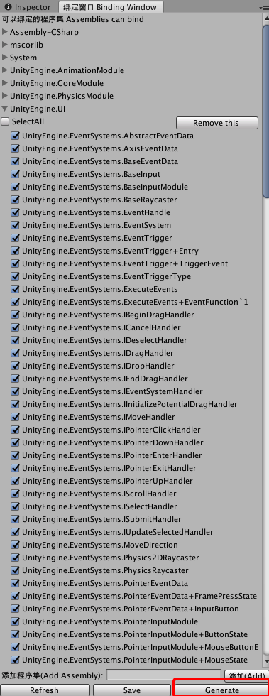

# typescript-for-unity

一个可以在 Unity 运行时运行编译成 Javascript 的 Typescript 脚本的插件。
本人于 2018 年 10 月 12 日开始独立开发这个项目，利用了大量的业余时间来完善整体结构，已经完成了在 Windows/Android/Mac/iOS 系统中通过 Unity 调用 Javascript 的功能。

A plugin for unity3d to run compiled typescripts as javascripts in runtime.
I made this project from 12th October 2018 and promote it at part time. Now we can run Javascript in Unity on Windows/Android/Mac/iOS.

## 目录结构 Folders

```
root
├── project // ts项目目录 typescript project directory
│ ├── library // unity相关API提示库 snippets/api for unity
│ │ ├── ...
│ ├── scripts // 会被编译的ts项目逻辑脚本 typescripts, will be compiled to javascripts to run in unity.
│ │ ├── ...
│ ├── tsconfig.json // ts项目配置文件
├── sources // 插件相关源码 plugin source code directory
│ ├── platforms // 各平台插件源码目录 plugin source code for each platforms
│ │ ├── android // 安卓平台插件工程文件目录 android plugin solution files
│ │ ├── apple // 苹果（iOS/macOS）工程文件目录 apple(iOS/macOS) plugin solution files
│ │ ├── typescript // 所有平台的代码 all source codes for supported platforms
│ │ ├── include // 公共头文件目录 common includes
│ │ ├── windows // Windows平台插件工程文件目录 Windows plugin solution files
│ ├── unity // 测试用unity项目目录 unity project for test
├── tools // 工具目录
│ ├── compile // 编译用工具目录 compile tools
│ ├── utils
```

## 使用说明 Instructions

### 生成绑定文件集 Generate binding files

1. 打开菜单 _General/Typescript/Binding Window_  
   Click menu _General/Typescript/Binding Window_

2. 勾选需要绑定的类型  
   Check types need to bind

3. 点击 Generate 按钮，生成绑定文件集  
   Click button _Generate_ to generate binding files



### 使用 Javascript 运行时 JavaScript Runtime

1. 通过菜单栏 General->Typescript->Initialize 创建本地配置*config.asset*。  
   Use menu item General->Typescript->Intialize to create local configurations _config.asset_.

2. ```
    General.Typescript.Entry.Initialize();
    General.Typescript.Entry.Execute("console.log(\"Hello world!\");", "");
   ```

### 使用动态绑定 Dynamic Binding

动态绑定仅用于 Windows/Mac/Android 平台，iOS 平台无法使用，因为 iOS 平台禁止使用反射机制。  
目前只支持动态绑定类，暂时不支持枚举。  
动态绑定只是需要扩展绑定的`临时方案`，因为反射机制的`运行效率较低`，不建议长期使用。  
Dynamic binding only can use on Windows/Mac/Android, iOS is not supported, as reflection is forbidden on iOS.  
It only support to bind class now, not enum.  
Dynamic binding is a `temporary solution` for binding extension, it is not recommended to use it for a long term because `reflection is slow`.

1. 首先，在任何可以访问的位置（最好是相对路径）创建一个配置文件*binding-config.json*。  
   First, creat _binding-config.json_ at any writable path (relative prefers) as the config file.  
   例如：

    ```
    {
         "assemblies": [
             {
                 "name": "System",
                 "types": [
                     "System.Net.WebClient"
                 ]
             },
             {
                 "name": "UnityEngine.CoreModule",
                 "types": [
                     "UnityEngine.Application",
                     "UnityEngine.GameObject"
                 ]
             },
             {
                 "name": "UnityEngine.UI",
                 "types": [
                     "UnityEngine.UI.Text"
                 ]
             }
         ]
     }
    ```

2. 在*config.asset*中设置*ExtraBindingConfigs*数组，以便通过绑定窗口生成创建智能提示文件*d.ts*。  
   Config array _ExtraBindingConfigs_ in _config.asset_, then BindingWindow will be able to generate snippets _d.ts_ for extra bindings.

3. 通过以下代码，可以动态绑定类型。  
   Bind types dynamically.
    ```
     if (General.Typescript.Entry.Initialize())
     {
         General.Typescript.FileUtility.AddSearchPath(*a search path*);
         General.Typescript.BinderUtility.BindFromJson(*binding config's relative path from any search path*);
     }
    ```

## <font color=#a00000>TODO</font>

-   Move file utility to native codes, in order to read file sync on Android
-   Optimize implementations with v8, in order to run faster
-   Make editor support for unity, in order to make coding more convenient.
